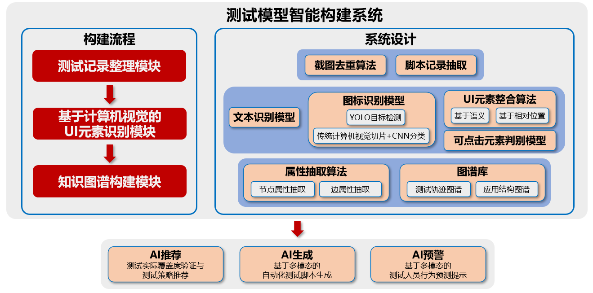

# Automated Test
## Introduction
- 基于模型的软件测试使用抽象化的方式对软件行为和结构进行阐述并产生测试用例。这种方式通过对测试结果的分析可以提高相关测试工具、产品的可重用性，相比于其他测试方式，基于模型的测试也更高效，更具有自动化测试的潜力。
- 由于基于模型的测试对相关人员的知识和理论储备要求较高，且需要较多前期投入（如选取模型、构造模型等），其产生的人力成本不可忽视。目前，软件测试业界在智能化测试模型构建系统方面相关研究仍有较大空白。因此，研发一套智能化的测试模型构建系统对我行软件测试工作的降本增效有重要意义。
- 测试模型智能构建系统运用计算机视觉技术识别我行测试截图记录中的按钮、文本提示等UI元素，结合所记录的测试轨迹，综合使用各类人工智能模型建立知识图谱；通过分析图谱库中测试执行情况、测试实际覆盖情况等，系统将可实现智能化测试策略推荐、智能化测试模型构建、智能化测试流程提示等功能，以提高测试效率，降低成本。

## Function
### 构建智能测试
对于可执行自动化测试的应用，依据系统生成的测试模型构建自动化测试脚本，再通过自动化测试工具进行测试，并将测试结果继续反馈至系统，形成闭环；

### 生成指定测试
根据测试需求文档，直接构建测试模型。对于可执行自动化测试的应用，继续生成自动化测试脚本并执行。

### 提示测试步骤
根据测试人员当前操作步骤，结合测试手册或需求文档，提示后续步骤、检验操作是否偏离原定测试目标。

## Timeline
### 2023
现存（以及可能新加入的）手机端app截图组（不论是哪个app）全部识别、入图，评估流程泛化性，并向电脑端迁移
#### 23Q1
##### 1月
###### 1月计划
软件测试相关概念、问题澄清，共享空间建立，设备申请等
模型、流程解耦（主要是视觉方面）
分工：
- 探索与收集外部数据集、现有解决方案，形成简报
- 调用ocr，分析文字识别结果，先实现规则过滤出可点击文字
- 图谱建立的伪代码、逻辑（部分代码）
- 0203进行月度总结

###### 1月回顾
- uied pipeline
  - ocr
  - cv
    - 传统cv
    - yolo模型训练（rico数据集）、预测结果
- 图谱代码完成、使用模拟json文件完成测试

###### 待解决问题
- 大框架已有，需要确定优化细节
  - uied代码逻辑拆解->他是怎么融合框体的，我们需要做什么改进（可能涉及很多小算法、规则，b-v取舍（算法+应用特制参数？））
  - ui元素：yolo->素材库问题，能否拿到自己的ui元素、美术资源（等汇报后领导反馈）
  - 文字：如何确定文字是否可点击，是否需要联动附近图标判断，或者引入模型？（确定模型输入要包含什么（相对位置信息+周围图标信息+文本？））

- 确定兜底产出
  - 已跟领导提出是否存在撞车问题，等反馈（推荐覆盖度）
  - 能走到汇报文档中的哪一步
    - 推荐系统概念、设计，需要做哪些准备
    - 依据什么、推荐什么

- 环境
  - 可能DMZ
  - 配置难度如何

- 项目组织方面
  - 汇报当周周二下班前总结一下进度，汇总
  - 碰头频率？

- 2月进度安排和分工
- 其他？

开发应该是有每个页面应包括什么的规范吧？

组成结构图
结构之间的关联

专利
yolo在所有图片中识别一次
优化rico

源码读取ui元素位置：相当于前端代码+前端页面进行分析，直接形成图（或进行页面打标，用作yolo训练数据集）
redraw 11w 21个类别有图标没位置->切片？

同样的元素在不同图片中 识别率不同
哪里可以点击 开发有记录（代码分析）

新功能咋办？新页面咋办？

已有整合方法
现阶段集中于最小元素的探测

##### 2
- 初步建模
  - 视觉方面：按钮识别与定位
  - 图谱方面：完成代码，用模拟的json完成测试
- 0303月度总结

###### 2月计划
总述：现阶段任务集中于最小元素的探测

UIED框架整理（一臻）
- 【兜底】CV框体融合算法、CV+OCR框体融合算法拆解
- 【提升】2月10日讨论基于UI层级预测的UI重组可行性（Screen Parsing: Towards Reverse Engineering of UI Models from Screenshots）、对我们工作的帮助，争取月内复现（难度较大，可能涉及实体补全）（实体补全技术后续可以用于整个测试流程的补全，值得投入时间）（复现后，可能替代UIED的简单框体融合算法）
- 留意判别可点击元素方法

【提升】apk解包工作（锦阳）
- 基于e生活apk进行解包，提取ui和美术资源
- 基于应用市场上全量工行app解包

【兜底】解包后备方案（锦阳）
- 基于redraw+rico训练图片分类模型（FastCNN或其他，根据调研结果选择）
- 通过UIED的CV算法提取图标，再进入分类模型，达到伪目标检测效果

【必要】截图去重开发（加贝）
- 输入为全部数据集，比如1，2，2，2，2，3，4，5，5，6，7，7，7；返回1，2，3，4，5，6，7
- 时序截图去重：只保留尾/保留头尾
- 非时序截图去重：保留一张
- 尽量打造成通用工具，不只是手机app测试截图，后续也要考虑pc端测试记录，甚至延展到其他非测试截图的场景
- 可以先从手机app测试截图实现

其他杂项：
- 服务器环境配置、虚拟环境配置、截图记录迁移
- 讨论和汇总时间更改，跟随双周报频率，2月10日周五讨论，2月22日周三下班前月度工作发组长，2月24日周五月度汇报
- 【必要】指必要模块，必须实现；【提升】工作需要有对应的【兜底】工作，保证系统的最低产出

##### 3
- 完成建模，根据真实json评估各模型效果
  - 文字：规则是否够用、是否需要NLP
  - 视觉：连续截图记录的过滤、弹窗处理
- 0331月度总结

#### 23Q2
- 根据Q1进度动态调整
- 泛化性测试（在多组图片下是否表现良好）、迭代更新

#### 23Q3
- 新人培训、现有成果（加贝7月交流结束/新人加入）
- 模型和流程泛化性达到要求，能把现存全部手机app截图组识别、入图

#### 23Q4
- 电脑端迁移（可能24Q1+24Q2）

## Related Works
https://paperswithcode.com/dataset/ricosca
